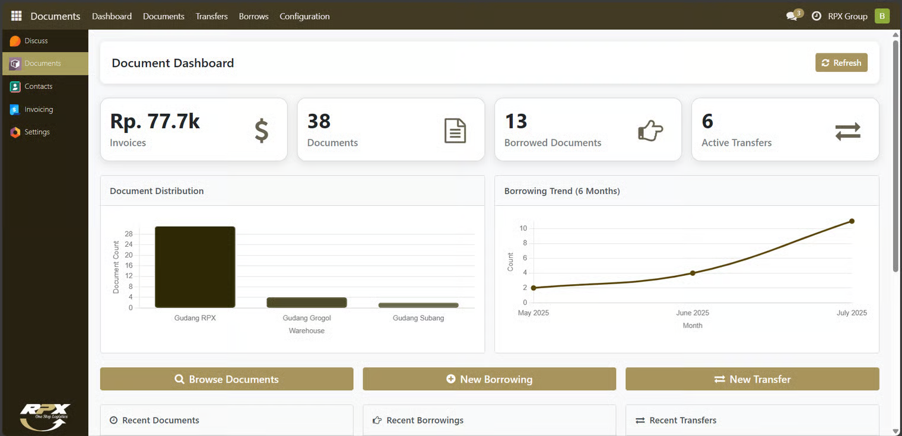

# Gambaran Umum

Document Management merupakan modul kustom Odoo yang dirancang khusus untuk mempermudah penyimpanan dan pengelolaan dokumen pada berbagai gudang. Hanya dengan satu modul, pengguna dapat mengatur dokumen di lebih dari satu gudang secara terintegrasi dan efisien.

<figure><figcaption></figcaption></figure>
